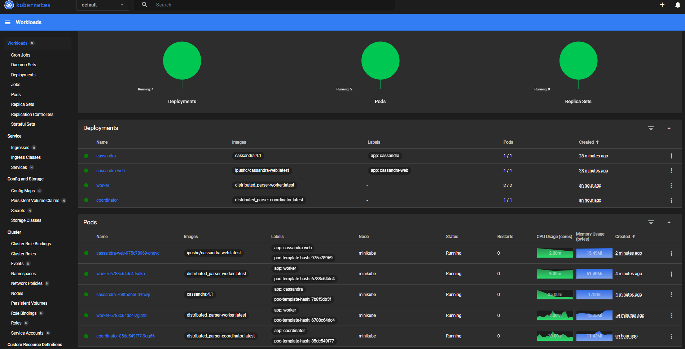
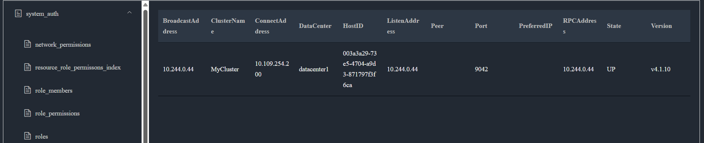

# 🚀 Distributed Parser with Cassandra, gRPC & Kubernetes

**End-to-end local development stack** for a distributed text-processing system powered by:
- **Apache Cassandra** (NoSQL database)
- **gRPC + Protocol Buffers** (microservice communication)
- **Kubernetes (Minikube)** (orchestration)
- **Streamlit Web UI** (`cassandra-web` on port `8083`)

> ✨ Perfect for **local development, testing, or demoing** a scalable parsing pipeline — no cloud needed.

---

## 🔍 What’s Inside?

- **Coordinator**: Orchestrates parsing jobs
- **Worker(s)**: Perform actual text processing
- **Cassandra**: Stores parsed results
- **Web UI**: Visualize and interact with data via Streamlit
- **gRPC**: Secure, fast communication between services

✅ Fully containerized  
✅ Ready for WSL2 / Linux / macOS  
✅ One-command startup

---

## 🚀 Quick Start (Recommended)

### 1. **Prerequisites**
Install these tools first:
- [Docker](https://www.docker.com/)
- [Minikube](https://minikube.sigs.k8s.io/docs/start/)
- [kubectl](https://kubernetes.io/docs/tasks/tools/install-kubectl/)

> 💡 **Windows users**: Use **WSL2** for best experience.

### 2. **Run the automation script**
```bash
chmod +x start.sh
./start.sh
```

This will:
- Build all Docker images (`coordinator`, `worker`, `grpc`, etc.)
- Generate gRPC code from `.proto` files
- Start Minikube
- Load images into the cluster
- Create Cassandra config (`setup.cql`)
- Deploy all services
- **Automatically open the web UI**

### 3. **Open the Web Interface**
Once the script finishes, open in your browser:
```
http://localhost:8083
```

> 🎯 That’s it! You’re running a full distributed system locally. Check proxy is active!

---

## 🛠 Manual Setup (Advanced)

Prefer control? Run steps manually:

```bash
# 1. Build base & service images
docker build -f ./docker/Dockerfile.vcpkg -t base-vcpkg .
docker build -f ./docker/Dockerfile.grpc -t grpc .
docker build -f ./docker/Dockerfile.prestart -t prestart .
docker build -f ./coordinator/Dockerfile -t distributed_parser-coordinator .
docker build -f ./worker/Dockerfile -t distributed_parser-worker .

# 2. Generate gRPC code
docker run --rm \
  -v $(pwd)/proto_files:/app/proto_files \
  -v $(pwd)/generated:/app/generated \
  grpc-generator

# 3. Start Minikube
minikube start

# 4. Load images into Minikube
minikube image load distributed_parser-coordinator:latest
minikube image load distributed_parser-worker:latest

# 5. Create Cassandra init config
kubectl create configmap cassandra-setup --from-file=setup.cql=./cassandra/setup.cql

# 6. Deploy everything
kubectl apply -f ./kubernetes/ --recursive

# 7. Access the Web UI
kubectl port-forward deployment/cassandra-web 8083:8083
# → Open http://localhost:8083
```

---

## 🖼️ Screenshots

### Minikube Dashboard


### Cassandra Web UI (Streamlit)

> 📌 **Tip**: Run `minikube dashboard` to monitor pods, services, and logs in real time.

---

## 🧪 Verify It Works

Check that all pods are running:
```bash
kubectl get pods
```

Expected output:
```
NAME                                      READY   STATUS    RESTARTS   AGE
cassandra-xxxxx                           1/1     Running   0          2m
cassandra-web-xxxxx                       1/1     Running   0          2m
coordinator-xxxxx                         1/1     Running   0          2m
worker-xxxxx                              1/1     Running   0          2m
```

---

## 🔍 SEO Keywords (for GitHub search)

`distributed parser`, `Cassandra Kubernetes`, `gRPC microservices`, `local Minikube setup`, `Streamlit Cassandra`, `text processing pipeline`, `Kubernetes development`, `protobuf gRPC example`, `WSL2 Kubernetes`, `CQL init script`

---

## 📬 Need Help?

- Ensure you’re using **WSL2 on Windows**
- If Cassandra crashes, reduce memory limits (see `kubernetes/cassandra-deployment.yaml`)
- For gRPC issues, verify `.proto` files are in `proto_files/`

> ✨ **Happy coding!** This stack is designed to get you from zero to distributed system in under 5 minutes.
